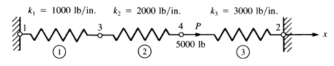

# NuSA

Numerical Structural Analysis in Python

## Version / Status

Current: **0.1.0.dev1** 

## Requirements

* NumPy
* Matplotlib (Optional for post)


## Installation

Using pip:

```
$ pip install nusa
```

## Capabilities

* Spring elements analysis
* Bar elements analysis
* 2D frames analysis
* Beams analysis

## Mini-Demos

### Spring element

**Example 01**. For the spring assemblage with arbitrarily numbered nodes shown in the figure 
obtain (a) the global stiffness matrix, (b) the displacements of nodes 3 and 4, (c) the 
reaction forces at nodes 1 and 2, and (d) the forces in each spring. A force of 5000 lb
is applied at node 4 in the `x` direction. The spring constants are given in the figure.
Nodes 1 and 2 are fixed.



```python
# -*- coding: utf-8 -*-
# NuSA Demo
from nusa.core import *
from nusa.model import *
from nusa.element import *
    
def test1():
    """
    Logan, D. (2007). A first course in the finite element analysis.
    Example 2.1, pp. 42.
    """
    P = 5000.0

    # Model
    m1 = SpringModel("2D Model")

    # Nodes
    n1 = Node((0,0))
    n2 = Node((0,0))
    n3 = Node((0,0))
    n4 = Node((0,0))

    # Elements
    e1 = Spring((n1,n3),1000.0)
    e2 = Spring((n3,n4),2000.0)
    e3 = Spring((n4,n2),3000.0)

    # Adding elements and nodes to the model
    for nd in (n1,n2,n3,n4):
        m1.addNode(nd)
    for el in (e1,e2,e3):
        m1.addElement(el)

    m1.addForce(n4, (P,))
    m1.addConstraint(n1, ux=0)
    m1.addConstraint(n2, ux=0)
    m1.solve()

if __name__ == '__main__':
    test1()
```


### Beam element

**Example 02**. For the beam and loading shown, determine the deflection at point C. 
Use E = 29 x 10<sup>6</sup> psi.


```python
"""
Beer & Johnston. (2012) Mechanics of materials. 
Problem 9.13 , pp. 568.
"""

# Input data 
E = 29e6
I = 291 # W14x30 
P = 35e3
L1 = 5*12 # in
L2 = 10*12 #in
# Model
m1 = BeamModel("Beam Model")
# Nodes
n1 = Node((0,0))
n2 = Node((L1,0))
n3 = Node((L1+L2,0))
# Elements
e1 = Beam((n1,n2),E,I,L1)
e2 = Beam((n2,n3),E,I,L2)

# Add elements 
for nd in (n1,n2,n3): m1.addNode(nd)
for el in (e1,e2): m1.addElement(el)
    
m1.addForce(n2, (-P,))
m1.addConstraint(n1, ux=0, uy=0) # fixed 
m1.addConstraint(n3, uy=0) # fixed
m1.solve() # Solve model

# Displacement at C point
print n2.uy
```

## Documentation

Tutorials (Jupyter notebooks):

* [Introduction to NuSA](docs/nusa-theory/intro-nusa.ipynb)
* [Spring element](docs/nusa-theory/spring-element.ipynb)
* [Bar element](docs/nusa-theory/bar-element.ipynb)
* [Beam element](docs/nusa-theory/beam-element.ipynb)

To build documentation based on docstrings execute the `docs/toHTML.py` script.

## About...

```
Developer: Pedro Jorge De Los Santos
E-mail: delossantosmfq@gmail.com
Blog: numython.github.io // jorgedelossantos.github.io
```